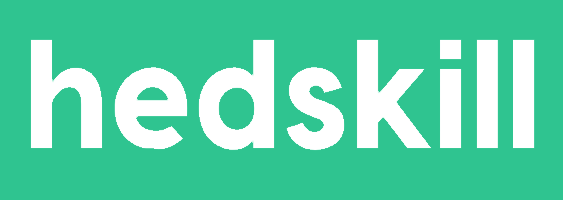

# hedskill

 
 

**TrueSkill™ powered custom league table for just about anything..**

## What is it?
hedskill is a mobile app uses the TrueSkill™ ranking system to construct an intelligent leaderboard based on a player's "true skill" in general and against each other. 

## How it works

Instead of simply totting up wins and losses and the winners and losers, the system learns a player's likelihood of winning against another and will issue different points to the winner depending on who won.

For example, if someone who wins all the time loses to someone at the bottom of the table, "surprising" the system, that person at the bottom will get a massive score. If however, the outcome was pretty predictable and the champ wins again, he/she won't get many points.

It's cool because the algorithm ensures that it's kept fairly even at the top of the table, and real champions have to consistently beat other champs in order to stay top, and not rely on totting up wins by beating those at the bottom of the table. Inversely, it also gives those at the bottom of the table a chance to get back into the game with only a few wins, rather than having to claw back millions of wins if they've not played for a while.

## What can it be used for?

Anything.

No really - whether you're playing darts in the pub every friday, playing RTS games with friends or mario kart with your housemates - this app can be used to provide a fun and simple way to prove your skill.

## Attribution

- TrueSkill™ is a registered trademark for the Microsoft TrueSkill™ [XBOX Live](http://www.xbox.com/live) ranking system developed by [Microsoft Research](https://www.microsoft.com/en-us/research). 

